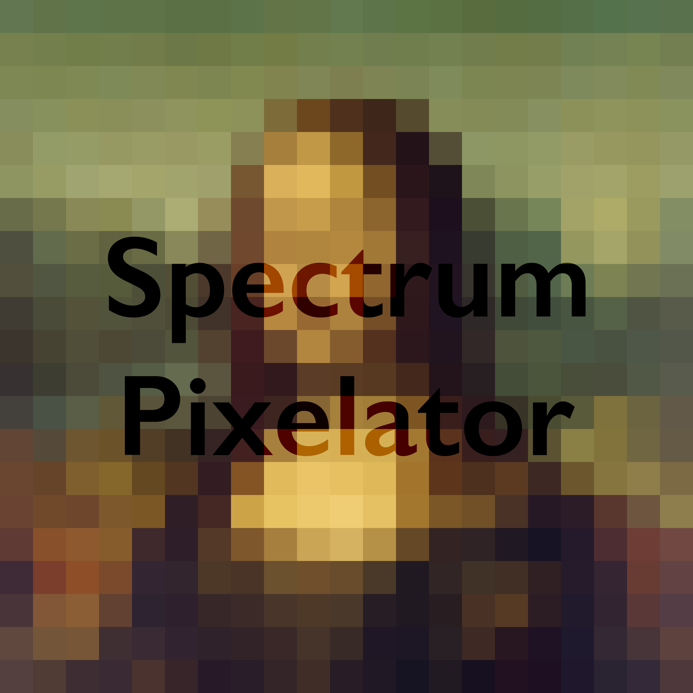
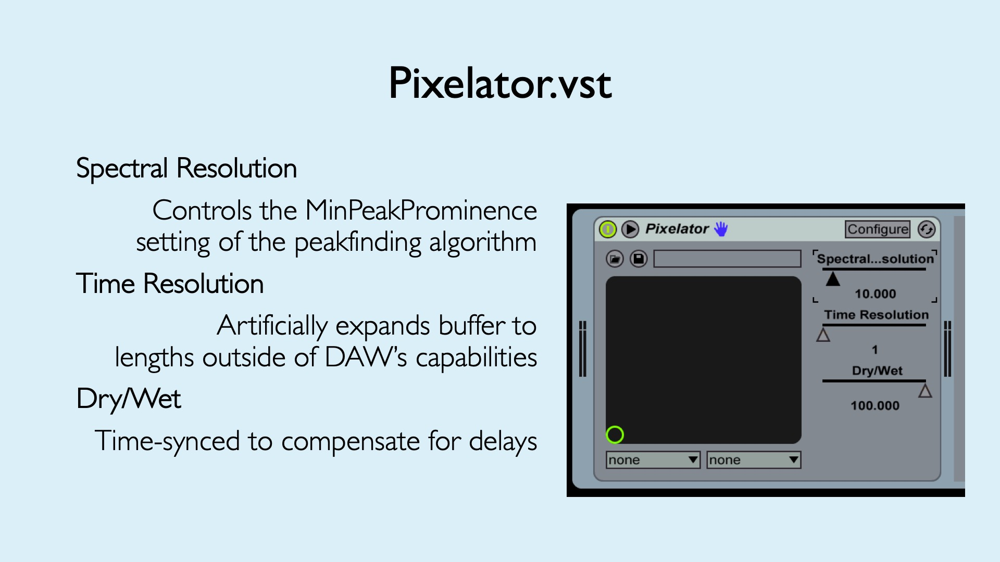

# spectrumPixelator

The Spectrum Pixelator is a real-time VST plugin that deconstructs a real-time audio signal into its most significant spectral components. By using advantages of the Modified Discrete Cosine Transform in eliminating time-domain artifacts, the Spectrum Pixelator alters the signal by isolating the most prominent spectral components of a signal and eliminating the remaining frequency components.

For more information, please visit the Mathworks File Exchange submission linked above, or watch the short demonstration video below.

 

This plugin won the Silver Award in the 2019 AES MATLAB Plugin Student Competition at the 247th Audio Engineering Society Convention.